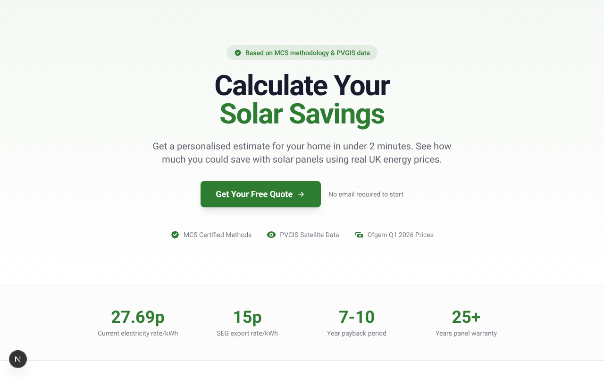
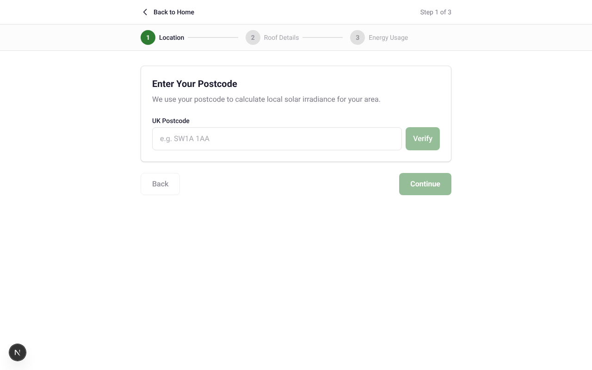

<p align="center">
  
</p>

<h1 align="center">SolarQuote UK</h1>

<p align="center">
  <strong>Calculate your solar panel savings with accurate UK energy prices</strong>
</p>

<p align="center">
  <a href="#features">Features</a> •
  <a href="#demo">Demo</a> •
  <a href="#getting-started">Getting Started</a> •
  <a href="#tech-stack">Tech Stack</a> •
  <a href="#api">API</a> •
  <a href="#accuracy">Accuracy</a>
</p>

<p align="center">
  
  
  
  
  
</p>

---

## Features

**For Homeowners:**

- Get accurate solar savings estimates in under 2 minutes
- See monthly generation forecasts based on your location
- Calculate payback period and 25-year ROI
- View environmental impact (CO2 savings, trees planted equivalent)
- Download detailed PDF reports

**For Solar Installers:**

- Qualified lead capture with GDPR compliance
- Lead scoring (Hot/Warm/Cool) based on potential value
- Webhook integration for CRM systems
- White-label ready

**Technical:**

- Progressive Web App - works offline
- Mobile-first responsive design
- Real-time postcode validation via postcodes.io
- Solar irradiance data from PVGIS satellite API
- Current UK energy prices (Ofgem Q1 2026)

---

## Demo

<p align="center">
  
</p>

**3-Step Calculator Wizard:**

1. **Location** - Enter your UK postcode to get local solar irradiance data
2. **Roof Details** - Specify orientation, pitch, area, and shading
3. **Energy Usage** - Enter your annual electricity consumption

**Instant Results:**

- Recommended system size (kWp)
- Annual savings breakdown (self-consumption + SEG export)
- Payback period and 25-year ROI
- Monthly generation charts
- CO2 savings with relatable comparisons

---

## Getting Started

### Prerequisites

- Node.js 18+
- npm or yarn

### Installation

```bash
# Clone the repository
git clone https://github.com/essels/solar-calculator.git
cd solar-calculator

# Install dependencies
npm install

# Start development server
npm run dev
```

Open [http://localhost:3000](http://localhost:3000) in your browser.

### Scripts

| Command                 | Description              |
| ----------------------- | ------------------------ |
| `npm run dev`           | Start development server |
| `npm run build`         | Build for production     |
| `npm run start`         | Start production server  |
| `npm run test`          | Run unit tests           |
| `npm run test:coverage` | Run tests with coverage  |
| `npm run test:e2e`      | Run E2E tests            |
| `npm run lint`          | Lint code                |

---

## Tech Stack

| Category       | Technology                                                        |
| -------------- | ----------------------------------------------------------------- |
| Framework      | [Next.js 16](https://nextjs.org/) (App Router)                    |
| Language       | [TypeScript 5](https://www.typescriptlang.org/)                   |
| Styling        | [Tailwind CSS 4](https://tailwindcss.com/)                        |
| Charts         | [Recharts](https://recharts.org/)                                 |
| PDF Generation | [jsPDF](https://github.com/parallax/jsPDF)                        |
| PWA            | [next-pwa](https://github.com/shadowwalker/next-pwa)              |
| Testing        | [Jest](https://jestjs.io/), [Playwright](https://playwright.dev/) |

---

## API

### POST `/api/calculate`

Calculate solar estimate from inputs.

```json
{
  "inputs": {
    "postcode": "SW1A 1AA",
    "latitude": 51.5,
    "longitude": -0.14,
    "roofOrientation": "S",
    "roofPitch": 35,
    "roofArea": 30,
    "shadingFactor": 1.0,
    "annualElectricityUsage": 3500,
    "homeOccupancy": "daytime"
  }
}
```

### POST `/api/leads`

Submit lead with calculation results (GDPR compliant).

### GET `/api/report`

Generate PDF report for a calculation.

---

## Accuracy

Based on **MCS (Microgeneration Certification Scheme)** methodology:

| Factor            | Source                                                                  |
| ----------------- | ----------------------------------------------------------------------- |
| Solar Irradiance  | [PVGIS](https://re.jrc.ec.europa.eu/pvg_tools/en/) satellite data       |
| Electricity Rate  | 27.69p/kWh ([Ofgem Q1 2026](https://www.ofgem.gov.uk/energy-price-cap)) |
| SEG Export Rate   | 15p/kWh (market average)                                                |
| System Losses     | 14% (industry standard)                                                 |
| Panel Degradation | 0.5%/year                                                               |
| CO2 Factor        | 0.233 kg/kWh (UK grid)                                                  |

**Results are within 10% of the [Energy Saving Trust calculator](https://energysavingtrust.org.uk/tool/solar-energy-calculator/).**

---

## Environment Variables

```bash
# Optional - defaults are configured
NEXT_PUBLIC_ELECTRICITY_RATE=27.69    # p/kWh
NEXT_PUBLIC_SEG_RATE=15.0             # p/kWh
NEXT_PUBLIC_LEAD_WEBHOOK_URL=         # Your CRM webhook
```

---

## Deployment

### Vercel (Recommended)

[](https://vercel.com/new/clone?repository-url=https://github.com/essels/solar-calculator)

1. Click the button above or connect your repo to Vercel
2. Set environment variables if needed
3. Deploy - Vercel auto-detects Next.js

### Docker

```bash
docker build -t solar-calculator .
docker run -p 3000:3000 solar-calculator
```

---

## Project Structure

```
├── src/
│   ├── app/                 # Next.js App Router pages
│   │   ├── api/            # API routes
│   │   ├── calculator/     # Calculator wizard
│   │   ├── results/        # Results display
│   │   └── thank-you/      # Post-submission page
│   ├── components/          # React components
│   │   ├── charts/         # Recharts visualizations
│   │   ├── modals/         # Lead capture modal
│   │   └── pwa/            # PWA components
│   ├── lib/                 # Business logic
│   │   ├── solar/          # Calculation engine
│   │   ├── leads/          # Lead scoring
│   │   └── validation/     # Input validation
│   └── types/               # TypeScript definitions
├── reference_data/          # UK lookup tables (JSON)
├── e2e/                     # Playwright E2E tests
└── docs/                    # Screenshots and docs
```

---

## Testing

**79 unit tests** covering:

- Calculation engine (100% coverage)
- Lead scoring algorithm (100% coverage)
- Input validation

**8 E2E test cases** covering:

- Complete user journey
- Mobile responsiveness
- Accessibility

```bash
# Run all tests
npm run test

# Run with coverage
npm run test:coverage

# Run E2E tests
npm run test:e2e
```

---

## Contributing

Contributions are welcome! Please read our contributing guidelines before submitting a PR.

1. Fork the repository
2. Create your feature branch (`git checkout -b feature/amazing-feature`)
3. Commit your changes (`git commit -m 'Add amazing feature'`)
4. Push to the branch (`git push origin feature/amazing-feature`)
5. Open a Pull Request

---

## License

MIT License - see [LICENSE](LICENSE) for details.

---

<p align="center">
  Made with ☀️ for UK homeowners
</p>
